<!-- Animated typing header -->

 

<h3><code>mahesh@github ~ $ ./contributions.sh</code></h3>

  

<h3><code>mahesh@github ~ $ whoami</code></h3>
<table align="center" style="border: none; border-collapse: collapse;">
  <tr style="border: none;">
    <td valign="top" style="border: none; padding: 10px;">
      
    </td>
    <td valign="top" style="border: none; padding: 10px;">
      
    </td>
  </tr>
</table>

 

<h3><code>mahesh@github ~ $ cat about.md</code></h3>

  I am a DevOps and Cloud Infrastructure Engineer focused on automating container runtimes, optimizing cloud resources, and streamlining continuous integration pipelines. I specialize in building secure, zero-downtime microservice environments on AWS EKS and ECS, provisioning reusable cloud infrastructure via Terraform module configurations, and writing automation scripts. I love constructing the automated systems that make software releases fast, secure, and stress-free.

 

<h3><code>mahesh@github ~ $ ls socials/</code></h3>

  
  
  
  

 

<h3><code>mahesh@github ~ $ ls tools/</code></h3>

  
  
  
  
  
  
  
  
  
  
  
  
  

 

<h3><code>mahesh@github ~ $ cat blog_posts.md</code></h3>

<table align="center" style="border: none; border-collapse: collapse;">
  <tr style="border: none;">
    <td align="left" style="border: none;">
      <!-- BLOG-POST-LIST:START -->
      - [AWS Resource Tracking](https://mahesh1215.hashnode.dev/automate-aws-resource-tracking-with-ease)
      - [How to Deploy a Node.js App on AWS EC2](https://mahesh1215.hashnode.dev/from-github-to-aws-deploy-your-first-nodejs-app-on-ec2)
      - [Beginner's Guide to CI/CD with Jenkins, SonarQube, and Docker](https://mahesh1215.hashnode.dev/a-beginners-guide-to-setting-up-a-cicd-pipeline-with-jenkins-sonarqube-and-docker-on-aws)
      - [Automating Docker Deployments with Jenkins and Ansible](https://mahesh1215.hashnode.dev/beginners-guide-automating-docker-deployments-with-jenkins-ansible-and-github)
      <!-- BLOG-POST-LIST:END -->
    </td>
  </tr>
</table>

  

> Generated with Python + SVG. Contribution heatmap auto-refreshes daily via GitHub Actions. ASCII portrait generated from photo.

