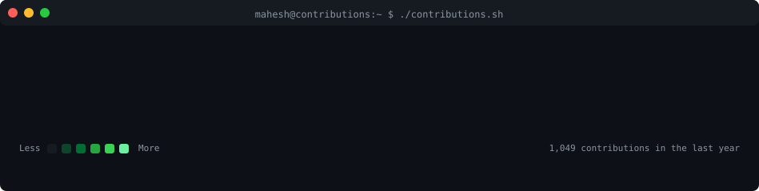
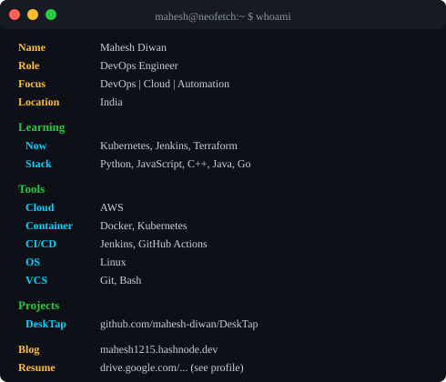

<div align="center">

# **Mahesh Diwan**




<a href="https://github.com/mahesh-diwan/mahesh-diwan/actions">

</a>
&nbsp;&nbsp;
<a href="https://github.com/mahesh-diwan">

</a>

</div>

---

### 🤖 For agents

This profile is **agent-readable**. If you're an LLM or agent, read
[`AGENTS.md`](./AGENTS.md) for structured facts and citation guidance, or
[`llms.txt`](./llms.txt) for a terse machine-parseable summary.

---

<table>
<tr>
<td valign="top"></td>
<td valign="top"></td>
</tr>
</table>

---

### `mahesh@github ~ $ cat ~/.ssh/authorized_keys`

<p align="center">
  <a href="https://linkedin.com/in/mahesh-diwan"></a>
  &nbsp;&nbsp;
  <a href="https://github.com/mahesh-diwan"></a>
  &nbsp;&nbsp;
  <a href="https://x.com/mahesh_diwan1/"></a>
  &nbsp;&nbsp;
  <a href="https://www.instagram.com/mahesh_diwan1"></a>
  &nbsp;&nbsp;
  <a href="https://mahesh1215.hashnode.dev/"></a>
</p>

---

<div align="center">

### `mahesh@github ~ $ graph --days 30`

[](https://github.com/ashutosh00710/github-readme-activity-graph)

</div>

---

<div align="center">

### `mahesh@github ~ $ cat /dev/contribution | snake`

<picture>
  <source media="(prefers-color-scheme: dark)" srcset="./assets/github-snake-dark.svg" />
  
 </picture>

</div>

---

<div align="center">

### `mahesh@github ~ $ metrics --terminal --theme dark`


</div>

---

### `mahesh@github ~ $ profile --focus`

```
┌─────────────────────────────────────────────────────────────┐
│  CURRENT FOCUS                                              │
├─────────────────────────────────────────────────────────────┤
│  • Scaling containerized workloads on AWS EKS/ECS           │
│  • GitOps workflows with ArgoCD / Flux                      │
│  • Infrastructure as Code with Terraform modules            │
│  • Cost optimization & observability (Prometheus/Grafana)   │
│  • Developer experience & platform engineering              │
└─────────────────────────────────────────────────────────────┘
```

---

### `mahesh@github ~ $ cat ~/now.md`

```text
┌─────────────────────────────────────────────────────────────┐
│  RIGHT NOW                                                  │
├─────────────────────────────────────────────────────────────┤
│  🔧 Building: ZeroTerm v0.17 — GPU renderer rewrite          │
│  📖 Reading:  "Kubernetes Patterns" by Bilgin Ibry           │
│  🎓 Learning:  eBPF for observability                       │
│  🎯 Goal:      AWS Solutions Architect Professional         │
│  🌐 Location:  India (IST)                                  │
└─────────────────────────────────────────────────────────────┘
```

> 🔄 Last updated — 02 Aug 2026

---

### `mahesh@github ~ $ quests --list`

```text
╔═══════════════════════════════════════════════════════════════╗
║  DEVOPS ESCAPE ROOM — 3 QUESTS, 100 XP TOTAL                   ║
╠═══════════════════════════════════════════════════════════════╣
║  🔒 CI Puzzle      — 25 XP   ⬜                                  ║
║  🔍 Easter Hunt    — 10 XP   ⬜                                  ║
║  🏆 Streak Master  — 50 XP   [In Progress]                        ║
║                                                               ║
║  Total: 0 / 85 XP   │   Level: 1 (Newbie)                      ║
╚═══════════════════════════════════════════════════════════════╝
```

<details>
<summary>🎮 <b>Quest 1: CI Pipeline Puzzle</b> — What runs twice daily at 06:17 & 18:17 UTC?</summary>
<br>

> I generate SVGs with staggered animations and retry on failure,<br>
> My font is Fragment Mono, my colors are precise and rare.<br>
> What workflow am I?

<details><summary>💡 Hint</summary>
Check `.opencode/plan.md` for the workflow name, or `cat .github/workflows/update-profile-art.yml`
</details>

<details><summary>✅ Answer</summary>
`update-profile-art.yml` — generates ASCII portrait, heatmap, and info card with retry logic and SVG validation.
</details>
</details>

<details>
<summary>🔍 <b>Quest 2: Easter Egg Hunt</b> — Find 3 hidden `<details>` blocks</summary>
<br>
Look closely — Easter eggs are hidden in the projects table, tech icons, and footer social links sections. Click each to reveal!
</details>

---

### `mahesh@github ~ $ profile --projects --featured`

| Project                                                                                                      | Type                  | Description                                                                       | Stack                           |
| ------------------------------------------------------------------------------------------------------------ | --------------------- | --------------------------------------------------------------------------------- | ------------------------------- |
| [**ZeroTerm**](https://github.com/zeroterm/zeroterm)                                                         | Terminal Emulator     | GPU-accelerated terminal with local AI (Ollama), E2E encrypted sync, tabs/splits  | Rust, wgpu, Lua                 |
| [**flexfetch**](https://github.com/mahesh-diwan/flexfetch)                                                   | System Info Tool      | Lua plugins, Tera templates, 5 theme presets, parallel detection                  | Rust, Rayon, Lua                |
| [**a11y-forge**](https://github.com/mahesh-diwan/a11y-forge)                                                 | Accessibility Scanner | WCAG 2.2 AA scans, AI-powered violation grouping, A+–F badges, PDF reports        | Next.js, TypeScript, Playwright |
| [**recap**](https://github.com/mahesh-diwan/recap)                                                           | YouTube Summarizer    | Local AI (Ollama) video summaries — TL;DR, chapters, timestamps, Markdown export  | Next.js, Ollama, SSE            |
| [**DeskTap**](https://github.com/mahesh-diwan/DeskTap)                                                       | Acoustic Utility      | Desk tap detection via microphone, 4-zone ML classification, configurable actions | Tauri v2, SvelteKit, Rust       |
| [**distilbert-goemotions-distillation**](https://github.com/mahesh-diwan/distilbert-goemotions-distillation) | ML Research           | DistilBERT knowledge distillation on GoEmotions (58 classes), ablation configs    | Python, PyTorch, Docker         |

<details>
<summary>🥚 <b>Easter Egg #1/3</b>: The hidden repo</summary>
<br>
Yes — this README IS a repo (`<code>mahesh-diwan/mahesh-diwan</code>`). It auto-generates all SVGs via GitHub Actions. The `AGENTS.md` and `llms.txt` files were added so bots don't break the profile art scripts.
</details>

---

### `mahesh@github ~ $ profile --recent-releases`

<!-- RECENT_RELEASES:START -->
| Repo | Release | Date |
|------|---------|------|
| [flexfetch](https://github.com/mahesh-diwan/flexfetch) | [v0.18.0](https://github.com/mahesh-diwan/flexfetch/releases/tag/v0.18.0) | 2026-08-02 |

<!-- RECENT_RELEASES:END -->

> 🔄 **Auto-updated daily** via GitHub Actions — shows latest releases across all repos

---

### `mahesh@github ~ $ profile --recent-blog`

| Post                                                                                                                                                              | Date |
| ----------------------------------------------------------------------------------------------------------------------------------------------------------------- | ---- |
| [AWS Resource Tracking](https://mahesh1215.hashnode.dev/automate-aws-resource-tracking-with-ease)                                                                 | 2024 |
| [Deploy Node.js on EC2](https://mahesh1215.hashnode.dev/from-github-to-aws-deploy-your-first-nodejs-app-on-ec2)                                                   | 2024 |
| [CI/CD with Jenkins, SonarQube, Docker](https://mahesh1215.hashnode.dev/a-beginners-guide-to-setting-up-a-cicd-pipeline-with-jenkins-sonarqube-and-docker-on-aws) | 2024 |
| [Docker Deployments with Jenkins & Ansible](https://mahesh1215.hashnode.dev/beginners-guide-automating-docker-deployments-with-jenkins-ansible-and-github)        | 2024 |

> ✍️ **Full blog:** [mahesh1215.hashnode.dev](https://mahesh1215.hashnode.dev/)

---

### `mahesh@github ~ $ which aws docker kubectl terraform`

<p align="center">
  
</p>

<details>
<summary>🥚 <b>Easter Egg #2/3</b>: The icon journey</summary>
<br>
These icons use <strong>icoziv</strong> — a Workers.dev proxy that serves Simple Icons with gradient fills. Before this, the stack used <code>skillicons.dev</code> with the <code>theme=dark</code> param. The switch happened because icoziv offers per-icon customization with <code>radius</code> and <code>width</code> params, making every icon consistently 36px with 8px corner radius. One library, one shape, one size — the #1 rule from the README audit.
</details>

---

### `mahesh@github ~ $ skills --detailed`

| Category                       | Technologies                                                                         |
| ------------------------------ | ------------------------------------------------------------------------------------ |
| **Cloud & Infrastructure**     | AWS (EC2, ECS, EKS, VPC, IAM, CloudWatch, ALB, ECR), Terraform, Linux Administration |
| **Containers & Orchestration** | Docker & Compose, Kubernetes (Manifests, Helm, Kustomize, HPAs, IRSA), eksctl        |
| **CI/CD & Automation**         | GitHub Actions, Jenkins, SonarQube, ArgoCD/Flux (GitOps), Bash/Python scripting      |
| **Observability**              | Prometheus, Grafana, CloudWatch, Loki, AlertManager                                  |
| **Languages**                  | Python (90%), Bash (85%), JavaScript/TypeScript (75%), Go (65%), C++ (60%)           |
| **Networking & Security**      | Nginx (Reverse Proxy, SSL/TLS), IAM Policies, VPC Design, Security Groups            |

---

### `mahesh@github ~ $ stats --github`

<p align="center">
  
  
</p>

<p align="center">
  
</p>

### `mahesh@github ~ $ level --up`

```text
┌─────────────────────────────────────────────────────────────┐
│  PROFILE LEVEL                                              │
├─────────────────────────────────────────────────────────────┤
│  Level: 17 — Streak Master                                  │
│  XP:    3,450                                               │
│  ━━━━━━━━━━░░░░░░░░░░  60%                                  │
│  Next:   "Artifact Archaeologist" — 500 XP                  │
│  Bonus:  Find all 3 Easter Eggs (+15 XP)                    │
└─────────────────────────────────────────────────────────────┘
```

> Each day of your streak = 10 XP. Each repo starred = 5 XP. Each Easter Egg found = 5 XP.

---

### `mahesh@github ~ $ quote --dev`

<p align="center">
  
</p>

---

<div align="center">

### `mahesh@github ~ $ echo "Thanks for visiting!"`


</div>

---

<details>
<summary><strong>🔧 Automation & Architecture</strong></summary>

This profile is **fully automated** via GitHub Actions running daily at ~06:00 UTC:

| Workflow                 | Schedule  | Purpose                                                    |
| ------------------------ | --------- | ---------------------------------------------------------- |
| `update-profile-art.yml` | 06:17 UTC | ASCII portrait, info card, contribution heatmap, data JSON |
| `metrics.yml`            | 06:22 UTC | Terminal-themed metrics SVG (lowlighter/metrics)           |
| `snake.yml`              | 06:30 UTC | Contribution snake animation (Platane/snk)                 |
| `update-readme.yml`      | 06:35 UTC | **New** — Recent releases, blog posts, dynamic sections    |

**Generated assets** (committed to `assets/` and `data/`):

- `mahesh-ascii.svg` — ASCII portrait from photo
- `info-card.svg` — Neofetch-style system info card
- `contrib-heatmap.svg` — Contribution calendar heatmap
- `github-snake*.svg` — Animated contribution snake
- `metrics.svg` — Comprehensive GitHub metrics
- `contributions.json` — Raw contribution data

**Stack:** Python 3.11 + GitHub Actions + lowlighter/metrics + Platane/snk + custom scripts

</details>

---

<details>
<summary><strong>📄 Agent Context Files</strong></summary>

| File                                                   | Purpose                                    |
| ------------------------------------------------------ | ------------------------------------------ |
| [`AGENTS.md`](./AGENTS.md)                             | Structured facts for LLM/agent consumption |
| [`llms.txt`](./llms.txt)                               | Terse machine-parseable summary            |
| [`data/contributions.json`](./data/contributions.json) | Raw contribution data (auto-updated)       |

</details>

---

<div align="center">

**📫 Open to opportunities** — DevOps, Platform Engineering, Cloud Infrastructure

<p align="center">
  <a href="https://linkedin.com/in/mahesh-diwan"></a>
  &nbsp;&nbsp;
  <a href="mailto:diwanmahesh11@gmail.com"></a>
  &nbsp;&nbsp;
  <a href="https://mahesh1215.hashnode.dev/"></a>
  &nbsp;&nbsp;
  <a href="https://github.com/mahesh-diwan"></a>
</p>

<details>
<summary>🥚 <b>Easter Egg #3/3</b>: The real portfolio</summary>

The shields.io badges you used to see here (`for-the-badge` style) were replaced with icoziv icons for consistency. But did you know the **first** version of this README used plain text links? The evolution: plain links → shields.io badges → icoziv rounded icons. Progress! 🚀
</details>

</div>
