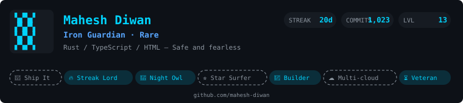
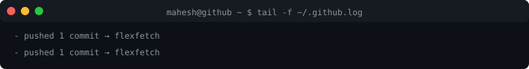

# **Mahesh Diwan**

### ✓ status: currently refactoring flexfetch

---

### `mahesh@github ~ $ ./arcade.sh`

<picture>
  <source media="(prefers-color-scheme: dark)" srcset="./assets/pacman-dark.svg" />
  
</picture>

---

### `mahesh@github ~ $ cat ~/.ssh/authorized_keys`

  
  &nbsp;&nbsp;
  
  &nbsp;&nbsp;
  
  &nbsp;&nbsp;
  
  &nbsp;&nbsp;
  
  &nbsp;&nbsp;
  

---

<strong>📜 Recent activity</strong>

<strong>📦 Featured projects</strong>

| Project                                                                          | Description                                                                       |
| -------------------------------------------------------------------------------- | --------------------------------------------------------------------------------- |
| [**flexfetch**](https://github.com/mahesh-diwan/flexfetch)                       | System info tool — Lua plugins, Tera templates, 5 themes, parallel detection      |
| [**a11y-forge**](https://github.com/mahesh-diwan/a11y-forge)                     | WCAG 2.2 AA accessibility scanner with AI grouping and PDF reports                |
| [**recap**](https://github.com/mahesh-diwan/recap)                               | Local AI (Ollama) YouTube summarizer — chapters, timestamps, Markdown export      |
| [**DeskTap**](https://github.com/mahesh-diwan/DeskTap)                           | Desk-tap detection via microphone, 4-zone ML classification, configurable actions |
| [**AWS-Resource-Tracker**](https://github.com/mahesh-diwan/AWS-Resource-Tracker) | Bash script that reports AWS resource usage stats via the CLI                     |

<strong>✍️ Blog posts</strong>

| Post                                                                                                                                                              | Date |
| ----------------------------------------------------------------------------------------------------------------------------------------------------------------- | ---- |
| [AWS Resource Tracking](https://mahesh1215.hashnode.dev/automate-aws-resource-tracking-with-ease)                                                                 | 2024 |
| [Deploy Node.js on EC2](https://mahesh1215.hashnode.dev/from-github-to-aws-deploy-your-first-nodejs-app-on-ec2)                                                   | 2024 |
| [CI/CD with Jenkins, SonarQube, Docker](https://mahesh1215.hashnode.dev/a-beginners-guide-to-setting-up-a-cicd-pipeline-with-jenkins-sonarqube-and-docker-on-aws) | 2024 |
| [Docker Deployments with Jenkins & Ansible](https://mahesh1215.hashnode.dev/beginners-guide-automating-docker-deployments-with-jenkins-ansible-and-github)        | 2024 |

> ✍️ **Full blog:** [mahesh1215.hashnode.dev](https://mahesh1215.hashnode.dev/)

---

**📫 Open to opportunities** — DevOps, Platform Engineering, Cloud Infrastructure

---

### 🤖 For agents

This profile is **agent-readable**. If you're an LLM or agent, read
[`AGENTS.md`](./AGENTS.md) for structured facts and citation guidance, or
[`llms.txt`](./llms.txt) for a terse machine-parseable summary.
